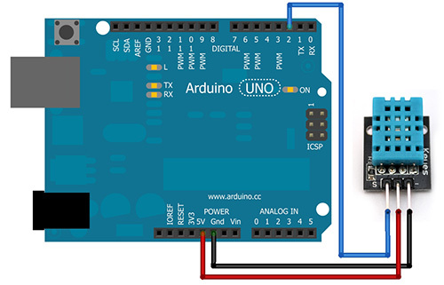

# Introduction to IoT

This is a small, practical and simple introduction to the concept of IoT through the use of a Arduino Uno, a lan adapter and a temperature and relative humidity sensor.

## Requirements

* Software:
  - [Arduino IDE](https://www.arduino.cc/en/Main/Software "Arduino IDE")
  - [DHT11 library](http://playground.arduino.cc/Main/DHT11Lib "DHT11 Library")
* Hardware:
  - See this collection: [eBay collection](http://www.ebay.com/cln/babysclem/arduino-iot/227391728016 "http://www.ebay.com/cln/babysclem/arduino-iot/227391728016")

## Setup

* Install Arduino IDE
* Install the DHT11 library as described [here](https://www.arduino.cc/en/Guide/Libraries "here").
* If you are using a recent version of OSx you might have issues with the USB connection to the Arduino. If so, check those links:
  - http://kiguino.moos.io/2014/12/31/how-to-use-arduino-nano-mini-pro-with-CH340G-on-mac-osx-yosemite.html
  - http://calumk.com/blog/0029/

## Hardware connections

Connect the hardware pieces together according to the following diagrams:

## Some testing

Before building your own code I recommand you test your hardware.
0x00,0x15,0x99,0xB7,0x98,0x8C