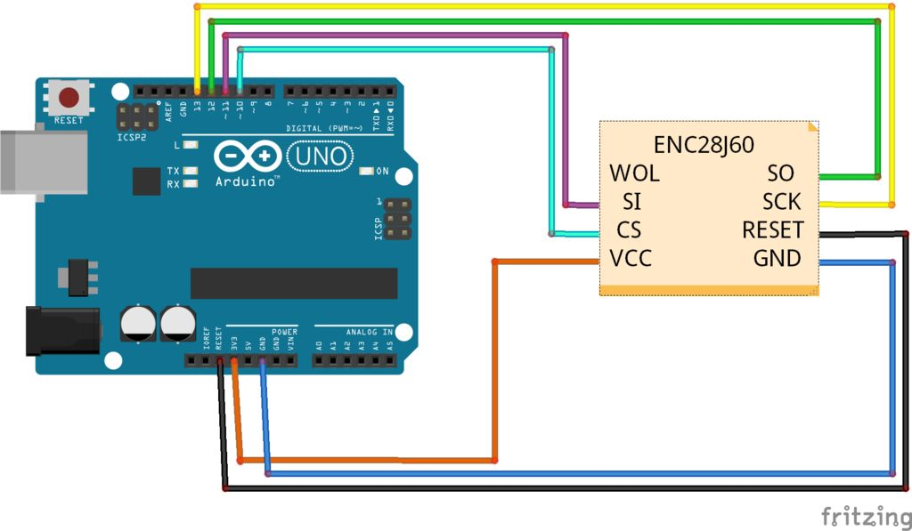

# Exercise 1: Create an end point

In this set of exercises we are going to use the ethernet module to connect our Arduino to the web.

## Hardware

Connect the hardware parts together according to the following diagram:



## Software

We will follow the same process than for the DHT11, first we load the library:

```c
#include <EtherCard.h>
```

(See this [reference](https://www.arduino.cc/en/Reference/Include "reference") to understand a bit more why this time we use `< >`)

Then we need to store a MAC address in a global variable (change the last value to your convenience, the MAC must be unique!):

```c
static byte mymac[] = { 0x00,0x15,0x99,0xB7,0x98,0x8C };
```

Finally we will store a small "web page" in a global constant:

```c
const char page[] PROGMEM =
"HTTP/1.0 202 OK\r\n"
"Content-Type: text/html\r\n"
"\r\n"
"<html>"
  "<head>"
    "<title>Workshop IoT</title>"
    "<meta charset=\"UTF-8\">"
  "</head>"
  "<body>"
    "<h1>Hello World!</h1>"
  "</body>"
"</html>";
```

Let's explain a bit this piece of code:

* `const` is to indicate that this is not a variable but a constant
* `char varName[]` is to initialize a char array (a string). Caution, this is not a `String` but a `string` (look at the references: [string](https://www.arduino.cc/en/Reference/String "string") V.S. [String](https://www.arduino.cc/en/Reference/StringObject "String")).
* `PROGMEM` is basically the same as using the `F()` macro, but this allows us to store a [pointer](https://www.arduino.cc/en/Reference/Pointer "pointer") to it.
* `HTTP ...` and `Conent-type ...` are part of the [HTTP headers](http://code.tutsplus.com/tutorials/http-headers-for-dummies--net-8039 "HTTP headers").
* `<html>...</html>` is the HTML code that will be rendered by your borwser.

Next step: prepare a buffer. The buffer is used to allocate a memory space for the Ethercard to communicate with the outisde world:

`byte Ethernet::buffer[500];`

Looking at the library files you will find out that the communication with the ethernet module needs some arguments: `static uint8_t begin (const uint16_t size, const uint8_t* macaddr, uint8_t csPin =8);`

the `size` can be computed from our `buffer`:

```c
sizeof Ethernet::buffer
```

The csPin is 10 in our case.

In the `setup()` function we should now have:

```c
ether.begin(sizeof Ethernet::buffer, mymac, 10);
```

We need to tell the ethernet module to look for an IP via the `dhcpSetup` method (see the library for documentation).

In the `loop()` function we are going to wait for incoming TCP packets, this is when a client is looking to read from the IP of your ethernet module:

```c
if (ether.packetLoop(ether.packetReceive())) {
 // We are going to do something here
}
```

Inside that `if` we need to treat that request, i.e. answer with the `page` we prepared. First lets copy our page in the right spot:

```c
memcpy(ether.tcpOffset(), page, sizeof page);
```

Then lets send it back:

```c
ether.httpServerReply(sizeof page - 1);
```

That's it!

Huh, wait ... how can I test that s#*t?

To test your skech you will need to know the IP your ethernet module got. For that you can output it in the Serial Monitor after the DHCP setup! Look at the library: `static uint8_t myip[4];   ///< IP address`. As you can see, this is a 8 byte encoded value, not easy to read. Hopefully there is this other method: `static void printIp (const uint8_t *buf);`.

Open your favourite brower (IE 4) (just kidding) and enter that IP in the address bar. Is it working?

Here is the complete sketch:

```c
#include <EtherCard.h>

#define ETHER_PIN 10     // what pin DHT the CS is connected to

// Ethernet MAC address
static byte mymac[] = { 0x00,0x15,0x99,0xB7,0x98,0x8C };

const char page[] PROGMEM =
"HTTP/1.0 202 OK\r\n"
"Content-Type: text/html\r\n"
"\r\n"
"<html>"
  "<head>"
    "<title>Workshop IoT</title>"
    "<meta charset=\"UTF-8\">"
  "</head>"
  "<body>"
    "<h1>Hello World!</h1>"
  "</body>"
"</html>";

byte Ethernet::buffer[500]; // tcp/ip send and receive buffer

void setup(){
  Serial.begin(115200);

  if (ether.begin(sizeof Ethernet::buffer, mymac, ETHER_PIN) == 0)
    Serial.println(F("Failed to access Ethernet controller"));

  if (!ether.dhcpSetup())
    Serial.println(F("DHCP failed"));
    
  ether.printIp(F("My IP: "), ether.myip);
}

void loop() {
  // wait for an incoming TCP packet, but ignore its contents
  if (ether.packetLoop(ether.packetReceive())) {
    // copy the page in the buffer
    memcpy(ether.tcpOffset(), page, sizeof page);
    // send the page
    ether.httpServerReply(sizeof page - 1);
  }
}
```

You will notice that there are somme assertions in the `setup()`, this is another good practice to check that the initialisation of each part of hardware is working properly.

## Nice work!

Yay! You did it! Let's go to the [next](exercise_03.md "next") set of exercices!